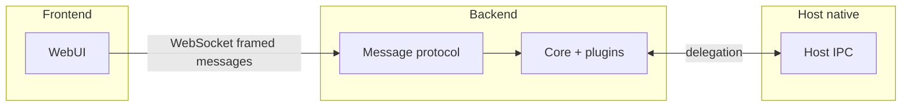

# @ekrooh/bare

**One soul, many platforms.** A single codebase and identity that lives
across every platform at once — the same app, state, and soul on Android, iOS,
web, and desktop.

[](https://github.com/AndersCan/ekrooh/actions/workflows/test.yml)

The **boring bootstrap** for cross-platform apps on the Bare runtime
(holepunch): a binary wire protocol, plugin kernel, RPC messenger, transports,
and native host bridges — plus a reference app that demonstrates all of it.

> Read `vision.md` for what this project is and is not, `AGENTS.md` for how to
> develop it, `CONTRIBUTING.md` for how to contribute, and `RELEASING.md` for
> how to cut a release.

## The model (UI perspective)

The **frontend** (browser or WebView) is written as if there is only a
**backend** reachable over a **WebSocket** (binary framed messages). It picks a
transport automatically:

- **WebSocket** everywhere on-device: the worklet runs **one loopback HTTP+WS
  server** that serves the web app, the media files, and the protocol socket,
  so the page connects to the same origin it was served from (`ws://location.host`).
- **Mock transport** when `VITE_TRANSPORT_MODE=mock` (tests).
- Browser dev points the WebSocket at the dev backend explicitly
  (`VITE_BARE_WS_URL`).

The UI does **not** branch on worklets, Bare, or host IPC. Shared types and
helpers (`@ekrooh/bare/core`) describe the **wire protocol** to the backend, not
the runtime that implements it.

## Glossary

| Term         | Meaning                                                                                      |
| ------------ | -------------------------------------------------------------------------------------------- |
| **Frontend** | Web UI: Vite bundle in the browser; same bundle in the Android/iOS WebView.                  |
| **Backend**  | Logic that runs the core bundle and speaks the framed message protocol with the frontend.    |
| **Host**     | Native shell (Android/iOS): starts the backend, owns system APIs, injects the session token. |

## Repository structure

- `core/` — framework: wire protocol codec, plugin router, RPC messenger, host
  IPC (`core/messages`), the unified loopback server (HTTP + WS + cookie auth),
  Bare worklet entry.
- `plugins/` — framework: canonical plugins (`core.health`, `core.discovery`,
  `core.permissions`, `vendor.media`) and typed event builders.
- `web/transports/` — framework: `MessageTransport` plus WebSocket and mock
  transports.
- `android/` — framework: Android host **library** (`:bare-host`) — IPC
  coordinator, host plugin registry, WebView client.
- `ios/` — framework: iOS host **Swift package** (`BareHost`) — IPC
  coordinator, host plugin registry.
- `examples/` — reference app: `web/` (lit-html + nanostores + Tailwind UI),
  `android-app/` (the Android shell that embeds the backend and WebView), and
  `ios-app/` (the iOS shell).
- `e2e/` — Playwright tests against the browser runtime on the mock transport.
- `scripts/` — dev backend runner, Playwright browser wrapper, prebuilds
  fetcher, loopback smoke test.
- `prebuilds/` — Bare Kit prebuilds (build output, gitignored).

The framework's public surface is the `exports` map of the root `package.json`
(`@ekrooh/bare/core`, `/runtime`, `/plugins`, `/plugins/*/events`, `/transports`).
The package ships **compiled ESM JavaScript + type declarations** (`dist/`,
built with `vp pack`) — consumers never see TypeScript source.

## Support matrix

| Runtime        | Status                         | Transport | Notes                                                                                                                                                           |
| -------------- | ------------------------------ | --------- | --------------------------------------------------------------------------------------------------------------------------------------------------------------- |
| Browser (dev)  | first-class                    | WebSocket | Vite + local backend server (`VITE_BARE_WS_URL`)                                                                                                                |
| Browser (test) | first-class                    | Mock      | Deterministic Playwright runs                                                                                                                                   |
| Android        | first-class                    | WebSocket | Same-origin loopback socket; cookie auth via the injected token                                                                                                 |
| iOS            | first-class (reference parity) | WebSocket | Same-origin loopback socket + cookie auth; host ships as source (`ios/`, SPM) on the same release tag; native picker/camera + Maestro journeys land before beta |
| Desktop        | contract                       | —         | Adapters follow the same plugin contracts                                                                                                                       |

### Parity policy

- Core protocol and plugin contracts are runtime-agnostic.
- Capabilities are opt-in plugins and may be runtime-specific.
- Plugins report unsupported behavior with deterministic errors.
- Feature code calls plugin events, not raw platform APIs from shared UI code.

## Architecture



## Message protocol

Binary frame:

- `version` (1 byte)
- `type` (1 byte)
- `headerLen` (2 bytes, big-endian)
- `header` (UTF-8 JSON)
- `payload` (optional)

Implementation: `MessageProtocol` in `core/messages` (see `wire-codec.ts`).

## Plugin-first architecture

Core does not ship product features (camera, permissions, BLE, etc.). Teams
add plugins with namespaced events and per-runtime handlers.

- Plugin IDs: `vendor.plugin`; events are plugin-local (`health.ping`).
- Header types: `DISPATCH`, `INVOKE_REQUEST`, `INVOKE_RESPONSE`; invoke
  responses echo `requestId`.
- `dispatch` is fire-and-forget; `invoke` is request/response and timeout-bound.
- Runtime adapters: `web`, `android`, `ios`, `bare`.
- Canonical plugins: `core.health`, `core.discovery`, `core.permissions`, and
  `vendor.media` (reference for out-of-band binary transfer).

### Loopback server + cookie auth

One loopback HTTP+WS server (`core/server/static-file-server.ts`) serves the
web app at `/`, the media files mounted by plugins, and the framed-protocol
WebSocket socket. On device it binds `127.0.0.1` on an ephemeral port and every
request is gated by a per-session token:

- The shell injects `window.__ekrooh = { token }` (plus `window.BareShell` as
  a presence marker) before the page loads.
- The page exchanges it for a `bare_session` cookie via `POST /login`
  (`HttpOnly; SameSite=Lax; Path=/`).
- The cookie then authorizes ``/`<video>`/`fetch` and the WebSocket
  upgrade. `X-Bare-Token`/`?token=` remain as a fallback for non-browser
  clients.
- The worklet writes `{ origin, port, token }` to `handoff.json` in the
  sandbox dir the host passed via `Worklet.Configuration.assets`; the host
  reads it, injects the token, and loads `http://127.0.0.1:<port>/index.html`.

The dev backend runs the same bundle with auth off on a fixed port
(`ws://localhost:8080`), so browser dev needs no token.

### Media (out-of-band bytes)

Images/videos never cross the wire protocol (the frame cap is 16 MiB).
`vendor.media` demonstrates the intended pattern: the host picks/captures a
file natively and returns its path; the worklet mounts it on the loopback
server and returns a URL. The web layer loads the URL directly (same-origin,
cookie-authenticated) — one serving implementation for every runtime. The
Android reference host wires a real native picker/camera; the iOS reference
host's real picker/camera is part of the iOS parity worklist.

## Scripts

| Script                       | Purpose                                                |
| ---------------------------- | ------------------------------------------------------ |
| `npm run check`              | Format + lint + type-check (`vp check`)                |
| `npm run typecheck`          | `tsc --noEmit` only                                    |
| `npm run test`               | Unit tests + Playwright e2e                            |
| `npm run test:unit`          | Unit tests (vitest)                                    |
| `npm run test:e2e:web`       | Playwright e2e                                         |
| `npm run dev`                | Vite dev server + Bare backend (watch restart)         |
| `npm run dev:mock`           | Vite with mock transport                               |
| `npm run dev:ws`             | Vite only (backend started separately)                 |
| `npm run build`              | Core bundle + web assets for the Android app           |
| `npm run build:core`         | Bundle `core/main.core.ts` with esbuild                |
| `npm run build:web`          | Build `examples/web` into the Android app's assets     |
| `npm run build:ios`          | iOS app inputs (addons, bundle, web assets) + xcodegen |
| `npm run prebuilds`          | Fetch Bare Kit prebuilds (requires `gh`)               |
| `npm run test:ios`           | XCTest + UI test on the iOS simulator                  |
| `npm run playwright:install` | Download Chromium into `.playwright-browsers/`         |
| `npm run smoke:loopback`     | Smoke-test the unified loopback server under `bare`    |

## Testing

- **Unit** — vitest (`vp test`) for the protocol codec, plugin router, RPC
  messenger, and transports; JUnit for the Kotlin host; XCTest for the Swift
  host.
- **Type check** — `tsc --noEmit` (part of `vp check`).
- **Integration** — Playwright e2e against the mock transport exercising the
  real binary protocol (`npm run test:e2e:web`). Browsers resolve through
  `scripts/playwright-local-browsers.mjs`, which pins `PLAYWRIGHT_BROWSERS_PATH`
  to the repo-local `.playwright-browsers/`.
- **Native end-to-end** — `npm run test:ios` runs the Swift host's XCTest suite
  plus a UI test against the reference app on the iOS simulator (discovery
  summary, Ping / Payload Echo / Roundtrip / Storage permission).

## Android build

Prerequisites: Android SDK (`local.properties` with `sdk.dir=...`) and Bare Kit
prebuilds.

```bash
npm ci
npm run prebuilds   # fetches prebuilds into prebuilds/ (gitignored)
npm run build       # core bundle + web assets
./gradlew :examples:android-app:assembleDebug
```

`./gradlew build` additionally runs the host library's JUnit tests.

## iOS build

Prerequisites: Xcode (macOS), Bare Kit prebuilds, and `xcodegen`.

```bash
npm ci
npm run prebuilds   # fetches prebuilds/ios/BareKit.xcframework too
npm run build:ios   # addons/, Resources/, and ios-app.xcodeproj
npm run test:ios    # xcodebuild test on the simulator
```

`npm run test:ios` runs the Swift host's XCTest suite (hosted by the reference
app) plus a UI test that verifies the health-checks page end to end.

## Asset hygiene

- Vite cleans hashed `examples/android-app/src/main/assets/assets/main-*.{js,css}`
  before rebuilding web assets.
- Treat files under `examples/android-app/src/main/assets/` as build output,
  not source.
