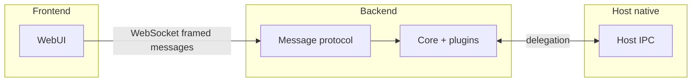
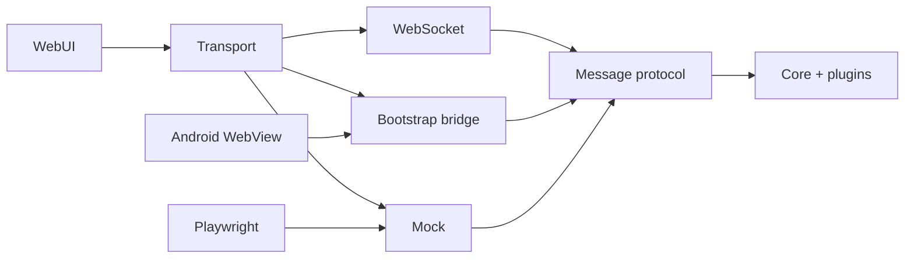

# Bare Android

Template for cross-platform apps: a small **protocol kernel** in `core/`, capabilities in `plugins/`, a **web UI** in `web/`, and an **Android shell** in `android/` that embeds the backend and WebView.

## Frontend vs backend (UI perspective)

The **frontend** (browser or WebView) is written as if there is only a **backend** reachable over a **WebSocket** (binary framed messages). It picks a transport automatically:

- **WebSocket** in local dev and when no injected bridge is present.
- **Mock transport** when `VITE_TRANSPORT_MODE=mock` (tests).
- **Bootstrap bridge** when `window.NativeBridge` exists (embedded WebView): same framed messages, delivered through the injected object instead of a socket.

The UI does **not** branch on worklets, Bare, or host IPC. Shared types and helpers (`MessageProtocol`, plugin bus, event builders) describe the **wire protocol** to the backend, not the runtime that implements it.

Repository docs below describe the **full stack** (host, worklet, delegation) for contributors shipping native shells.

## Glossary

| Term         | Meaning                                                                                                                                                                 |
| ------------ | ----------------------------------------------------------------------------------------------------------------------------------------------------------------------- |
| **Frontend** | Web UI: Vite bundle in the browser; same bundle in the Android WebView.                                                                                                 |
| **Backend**  | Logic that runs the core bundle and speaks the framed message protocol with the frontend (WebSocket server in dev; worklet on device).                                  |
| **Host**     | Native shell (e.g. Android): starts the backend, owns system APIs, and may expose a small bootstrap bridge to the WebView. Not a concept the UI code models explicitly. |

## Repository structure

- `core/`: protocol kernel (wire codec, plugin router, RPC messenger) and dev WebSocket server.
- `plugins/`: app capabilities and typed event builders (kept out of core).
- `web/`: UI entrypoint and transports (WebSocket, mock, bootstrap bridge).
- `android/`: Android host (worklet + IPC + WebView).
- `prebuilds/`: Bare Kit prebuilds required by Android packaging (not committed).
- `e2e/`: Playwright tests against the browser runtime.

## Support matrix

| Runtime        | Status      | Transport                         | Notes                                                       |
| -------------- | ----------- | --------------------------------- | ----------------------------------------------------------- |
| Browser (dev)  | first-class | WebSocket                         | Vite + local backend server                                 |
| Browser (test) | first-class | Mock                              | Deterministic Playwright runs                               |
| Android        | first-class | WebSocket and/or bootstrap bridge | Same protocol; bridge when the shell injects `NativeBridge` |
| iOS / desktop  | template    | —                                 | Adapters follow the same plugin contracts                   |

### Parity policy

- Core protocol and plugin contracts are runtime-agnostic.
- Capabilities are opt-in plugins and may be runtime-specific.
- Plugins report unsupported behavior with deterministic errors.
- Feature code calls plugin events, not raw platform APIs from shared UI code.

## Architecture (contributors)





## Message protocol

Binary frame:

- `version` (1 byte)
- `type` (1 byte)
- `headerLen` (2 bytes, big-endian)
- `header` (UTF-8 JSON)
- `payload` (optional)

Implementation: `MessageProtocol` in `core/messages` (see `wire-codec.ts`).

## Asset hygiene

- Vite and Gradle clean hashed `android/app/src/main/assets/assets/main-*.{js,css}` before rebuilding web assets.
- Treat files under `android/app/src/main/assets/assets/` as build output, not source.

## Plugin-first architecture

Core does not ship product features (camera, permissions, BLE, etc.). Teams add plugins with namespaced events and per-runtime handlers.

### Capability discovery

Invoke `core.discovery` / `discovery.list` on the backend for a merged capability list (`schemaVersion`, plugin rows, events, runtimes, etc.).

### Naming and routing

- Plugin IDs: `vendor.plugin`.
- Events: plugin-local (`health.ping`, `permissions.request`).
- Header types: `DISPATCH`, `INVOKE_REQUEST`, `INVOKE_RESPONSE`.
- Invoke requests include `requestId`; responses echo it.

### Dispatch vs invoke

- `dispatch`: fire-and-forget.
- `invoke`: request/response, timeout-bound, deterministic failures when unresolved.

### Bootstrap bridge (embedded WebView)

Web → native: JSON envelope with `type`, `header`, optional `payloadBase64` (see `BareBridge.send` in `MainActivity.kt`).

Native → web: evaluate `window.onBackendMessage({ type, header, payload })` where `header` is a JSON object and `payload` is base64 or omitted.

## Scripts

| Script                 | Purpose                                                    |
| ---------------------- | ---------------------------------------------------------- |
| `npm run dev`          | Vite + Bare backend server (watch restart)                 |
| `npm run dev:bare`     | Backend server only (used by `dev`)                        |
| `npm run dev:mock`     | Vite with mock transport                                   |
| `npm run dev:ws`       | Vite only (backend started separately)                     |
| `npm run dev:e2e`      | Vite on fixed host/port for Playwright                     |
| `npm run build:web`    | Build web assets into Android `assets/`                    |
| `npm run build:core`   | Bundle `core/main.core.ts` with esbuild                    |
| `npm run build:bare`   | Alias for `build:core`                                     |
| `npm run build`        | `build:core` then `build:web` (`build:android-assets`)     |
| `npm run playwright:install` | Download Chromium into `.playwright-browsers/` (run after `npm install` / `npm ci` before e2e tests) |
| `npm run test:e2e:web`       | Playwright                                                                             |
| `npm run lint`               | Prettier                                                                               |

## Browser-first testing

Playwright runs against local Vite with `MockTransport`, so you get fast feedback without an emulator while exercising the same binary protocol as `core/messages`.

**Browsers and Cursor’s sandbox:** Playwright resolves the browser directory when `playwright-core` first loads. Sandboxes may preset `PLAYWRIGHT_BROWSERS_PATH` to an empty cache, so setting the path only in `playwright.config.ts` is too late. **`npm run playwright:install`** and **`npm run test:e2e:web`** go through [`scripts/playwright-local-browsers.mjs`](scripts/playwright-local-browsers.mjs), which sets `PLAYWRIGHT_BROWSERS_PATH` to **`.playwright-browsers/`** in the repo before spawning the CLI (and `playwright.config.ts` keeps the same path in sync). After `npm install` / `npm ci`, run **`npm run playwright:install`** once (or whenever you upgrade `@playwright/test`); output is gitignored.

## Android build

1. Place Bare Kit prebuilds under `prebuilds/android/bare-kit` (see **Prebuilds**).
2. From repo root:

```bash
npm ci
npm run build
```

3. APK:

```bash
cd android
./gradlew assembleDebug
```

## Prebuilds

Download a Bare Kit release:

```bash
gh release download --repo holepunchto/bare-kit <version>
```

Unpack `prebuilds.zip` and put `android/bare-kit` inside this repository’s `prebuilds/` directory.
