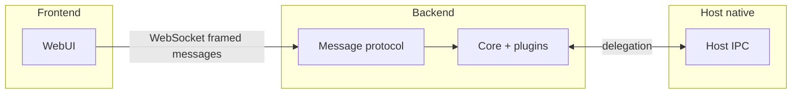

# @less/bare

The **boring bootstrap** for cross-platform apps on the Bare runtime
(holepunch): a binary wire protocol, plugin kernel, RPC messenger, transports,
and native host bridges — plus a reference app that demonstrates all of it.

> Read `vision.md` for what this project is and is not, `AGENTS.md` for how to
> develop it, `CONTRIBUTING.md` for how to contribute, and `RELEASING.md` for
> how to cut a release.

## The model (UI perspective)

The **frontend** (browser or WebView) is written as if there is only a
**backend** reachable over a **WebSocket** (binary framed messages). It picks a
transport automatically:

- **WebSocket** in local dev and when no injected bridge is present.
- **Mock transport** when `VITE_TRANSPORT_MODE=mock` (tests).
- **Bootstrap bridge** when `window.NativeBridge` exists (embedded WebView).

The UI does **not** branch on worklets, Bare, or host IPC. Shared types and
helpers (`@less/bare/core`) describe the **wire protocol** to the backend, not
the runtime that implements it.

## Glossary

| Term         | Meaning                                                                                          |
| ------------ | ------------------------------------------------------------------------------------------------ |
| **Frontend** | Web UI: Vite bundle in the browser; same bundle in the Android WebView.                          |
| **Backend**  | Logic that runs the core bundle and speaks the framed message protocol with the frontend.        |
| **Host**     | Native shell (e.g. Android): starts the backend, owns system APIs, exposes the bootstrap bridge. |

## Repository structure

- `core/` — framework: wire protocol codec, plugin router, RPC messenger, host
  IPC (`core/messages`), dev WebSocket server, Bare worklet entry.
- `plugins/` — framework: canonical plugins (`core.health`, `core.discovery`,
  `core.permissions`) and typed event builders.
- `web/transports/` — framework: `MessageTransport` plus WebSocket, mock, and
  bootstrap-bridge transports.
- `android/` — framework: Android host **library** (`:bare-host`) — IPC
  coordinator, host plugin registry, WebView bridge.
- `examples/` — reference app: `web/` (lit-html + nanostores + Tailwind UI)
  and `android-app/` (the Android shell that embeds the backend and WebView).
- `e2e/` — Playwright tests against the browser runtime on the mock transport.
- `scripts/` — dev backend runner, Playwright browser wrapper, prebuilds
  fetcher.
- `prebuilds/` — Bare Kit prebuilds (build output, gitignored).

The framework's public surface is the `exports` map of the root `package.json`
(`@less/bare/core`, `/plugins`, `/plugins/*/events`, `/transports`). The package
ships TypeScript source and is consumed through a bundler (Vite, esbuild, or
bare-pack).

## Support matrix

| Runtime        | Status      | Transport                         | Notes                                                       |
| -------------- | ----------- | --------------------------------- | ----------------------------------------------------------- |
| Browser (dev)  | first-class | WebSocket                         | Vite + local backend server                                 |
| Browser (test) | first-class | Mock                              | Deterministic Playwright runs                               |
| Android        | first-class | WebSocket and/or bootstrap bridge | Same protocol; bridge when the shell injects `NativeBridge` |
| iOS / desktop  | contract    | —                                 | Adapters follow the same plugin contracts                   |

### Parity policy

- Core protocol and plugin contracts are runtime-agnostic.
- Capabilities are opt-in plugins and may be runtime-specific.
- Plugins report unsupported behavior with deterministic errors.
- Feature code calls plugin events, not raw platform APIs from shared UI code.

## Architecture



## Message protocol

Binary frame:

- `version` (1 byte)
- `type` (1 byte)
- `headerLen` (2 bytes, big-endian)
- `header` (UTF-8 JSON)
- `payload` (optional)

Implementation: `MessageProtocol` in `core/messages` (see `wire-codec.ts`).

## Plugin-first architecture

Core does not ship product features (camera, permissions, BLE, etc.). Teams
add plugins with namespaced events and per-runtime handlers.

- Plugin IDs: `vendor.plugin`; events are plugin-local (`health.ping`).
- Header types: `DISPATCH`, `INVOKE_REQUEST`, `INVOKE_RESPONSE`; invoke
  responses echo `requestId`.
- `dispatch` is fire-and-forget; `invoke` is request/response and timeout-bound.
- Runtime adapters: `web`, `android`, `ios`, `bare`.

### Bootstrap bridge (embedded WebView)

- Web → native: JSON envelope with `type`, `header`, optional `payloadBase64`
  (see `BareBridge` in the host library).
- Native → web: `window.onBackendMessage({ type, header, payload })`.

## Scripts

| Script                       | Purpose                                            |
| ---------------------------- | -------------------------------------------------- |
| `npm run check`              | Format + lint + type-check (`vp check`)            |
| `npm run typecheck`          | `tsc --noEmit` only                                |
| `npm run test`               | Unit tests + Playwright e2e                        |
| `npm run test:unit`          | Unit tests (vitest)                                |
| `npm run test:e2e:web`       | Playwright e2e                                     |
| `npm run dev`                | Vite dev server + Bare backend (watch restart)     |
| `npm run dev:mock`           | Vite with mock transport                           |
| `npm run dev:ws`             | Vite only (backend started separately)             |
| `npm run build`              | Core bundle + web assets for the Android app       |
| `npm run build:core`         | Bundle `core/main.core.ts` with esbuild            |
| `npm run build:web`          | Build `examples/web` into the Android app's assets |
| `npm run prebuilds`          | Fetch Bare Kit prebuilds (requires `gh`)           |
| `npm run playwright:install` | Download Chromium into `.playwright-browsers/`     |

## Testing

- **Unit** — vitest (`vp test`) for the protocol codec, plugin router, RPC
  messenger, and transports; JUnit for the Kotlin host.
- **Type check** — `tsc --noEmit` (part of `vp check`).
- **Integration** — Playwright e2e against the mock transport exercising the
  real binary protocol (`npm run test:e2e:web`). Browsers resolve through
  `scripts/playwright-local-browsers.mjs`, which pins `PLAYWRIGHT_BROWSERS_PATH`
  to the repo-local `.playwright-browsers/`.

## Android build

Prerequisites: Android SDK (`local.properties` with `sdk.dir=...`) and Bare Kit
prebuilds.

```bash
npm ci
npm run prebuilds   # fetches prebuilds into prebuilds/ (gitignored)
npm run build       # core bundle + web assets
./gradlew :examples:android-app:assembleDebug
```

`./gradlew build` additionally runs the host library's JUnit tests.

## Asset hygiene

- Vite cleans hashed `examples/android-app/src/main/assets/assets/main-*.{js,css}`
  before rebuilding web assets.
- Treat files under `examples/android-app/src/main/assets/` as build output,
  not source.
