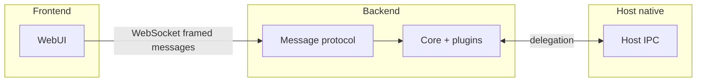

## Frontend

The same Vite bundle runs in the browser and in the Android/iOS WebView. It
imports `@ekrooh/bare/core` for shared types and `@ekrooh/bare/transports`
for a `MessageTransport`, then speaks the framed protocol over WebSocket. It
never knows about worklets, Bare, or host IPC.

## Backend

The worklet (a Bare process started by the host) runs the core bundle: a
plugin kernel, RPC messenger, and the **unified loopback HTTP+WS server**.
That one server serves the web app at `/`, media files mounted by plugins, and
the framed-protocol WebSocket socket — gated by cookie auth on device.

## Host

The native shell (Android/iOS) starts the backend, owns system APIs (camera,
pickers, permissions), and injects the session token into the page. Capabilities
are opt-in plugins; the host handles them through a typed plugin registry.

## Parity policy

- Core protocol and plugin contracts are runtime-agnostic.
- Capabilities are opt-in plugins and may be runtime-specific.
- Plugins report unsupported behavior with deterministic errors.
- Feature code calls plugin events, not raw platform APIs.
