A "native function" in ekrooh is just a **consumer plugin event**: the web layer
sends an invoke, a worklet handler runs the capability, and the result comes back
to the UI. The framework provides the wire protocol, request/response matching,
and the transport — you own the event contract and the handler logic.

The smallest complete example is the repo's
`examples/consumer-basic` (`app.basic` plugin): one invoke (`basic.ping`), one
backend → web push (`basic.beep`), and a web button that calls both. This guide
traces that flow end to end and shows how to add your own capability by following
the same four steps.

## The shape of a native call

```mermaid
flowchart LR
  W[Web UI] -->|invoke| M[Protocol Messenger]
  M -->|ENVELOPE over transport| R[Worklet runtime]
  R -->|handler runs capability| H[Plugin invoke handler]
  H -->|ok&#40;result&#41;| R
  R -->|INVOKE_RESPONSE| M
  M -->|bus.invoke result| W
```



Two pieces are **consumer-owned**:

- the **event contract** — the event name plus its `args`/`result` types, and
- the **handler logic** — what the capability actually does.

Everything else (wire framing, requestId matching, the WebSocket transport, the
worklet runtime) is framework-provided.

## 1. Define the event contract (shared)

One `EventSpec` per event is the single source of truth. It drives the manifest,
the handler table, and the typed client builders, so the wire name and the
client-side type can never drift apart.

```ts
import { EventSpec, invokeEvent } from '@ekrooh/bare/core';

export const helloSpecs = {
  greet: {
    pluginId: 'app.hello',
    name: 'hello.greet',
    args: {} as { name?: string },
    result: {} as { reply: string },
  },
} as const satisfies Record<string, EventSpec<any, any>>;

export const helloEvents = {
  greet(name = 'world') {
    return invokeEvent(helloSpecs.greet, { name });
  },
};
```

`invokeEvent(spec, args)` returns a typed invoke envelope. Keep this file free of
runtime logic — both the worklet and the web layer import it so they agree on the
contract.

## 2. Implement the worklet handler

`definePlugin` wires the `EventSpec` to a handler table. Each `invoke` handler
returns `Either<CoreError, TResult>` via `ok`/`err`.

```ts
import { definePlugin, ok } from '@ekrooh/bare/core';
import type { LoopbackPush } from '@ekrooh/bare/runtime';
import { helloSpecs } from '../shared/hello-events';

export function createHelloPlugin(deps: { push: LoopbackPush }) {
  return definePlugin('app.hello', helloSpecs, {
    capabilities: ['hello'],
    invoke: {
      greet(args) {
        return ok({ reply: `hello, ${args?.name ?? 'world'}` });
      },
    },
  });
}
```

The `pluginId` must match the spec's `pluginId`, or `definePlugin` throws. This is
where native work happens: read a file, open a camera, call into a host delegate —
anything the worklet runtime can do.

## 3. Register it in the worklet entry

Create the worklet runtime, build the push seam, and register the plugin before
starting:

```ts
import {
  createLoopbackPush,
  createWorkletRuntime,
  resolveWorkletConfig,
} from '@ekrooh/bare/runtime';
import { createHelloPlugin } from './hello-plugin';

const runtime = createWorkletRuntime(resolveWorkletConfig());
const push = createLoopbackPush(runtime.server, runtime.protocol);
runtime.pluginRegistry.register(createHelloPlugin({ push }));
void runtime.start();
```

`resolveWorkletConfig()` reads the host-supplied configuration (device assets,
dev flags); under the bare CLI it resolves to `{}` (dev mode). Plugins that depend
on the loopback socket are created after the runtime exists.

## 4. Call it from the web

The web layer wraps the transport in a protocol messenger and a plugin bus, then
invokes the typed event:

```ts
import {
  MessageType,
  createPluginBus,
  createProtocolMessenger,
} from '@ekrooh/bare/core';
import { helloEvents } from '../shared/hello-events';
import { transport } from './transport';

const messenger = createProtocolMessenger((request, payload) => {
  transport.send(MessageType.ENVELOPE, request, payload);
});
const bus = createPluginBus(messenger);

const [err, result] = await bus.invoke(helloEvents.greet('consumer'));
// result?.reply === 'hello, consumer'
```

`createProtocolMessenger` hands request/response bytes to `transport.send`; the
messenger matches the `INVOKE_RESPONSE` requestId back to `bus.invoke`. The raw
`transport.invoke(envelope)` form is available too (see
[Authoring a Plugin](../consumers/authoring-plugins.mdx)) — the plugin bus is the
typed convenience over it.

## Beyond request/response: backend → web push

Not every update is a reply to an invoke. A server-initiated update — a progress
tick, a notification — uses a `DISPATCH` (no requestId). The `app.basic` example
pushes a `basic.beep` on every ping via `LoopbackPush`:

```ts
// in the worklet handler
deps.push(basicBeepHeader(beepCount));
```

The web layer matches the `DISPATCH` header by `pluginId`/`event` and re-renders.
`LoopbackPush` (built from `runtime.server` + `runtime.protocol`) is the
framework-provided seam for backend → web messages — see
[Backend → Web Push](../consumers/backend-push.mdx).

## Host-owned capabilities (the IPC seam)

Some capabilities are owned by the host, not the worklet: camera, photo capture,
permissions. A consumer plugin declares the events but forwards the invoke to the
host instead of answering locally, using `HOST_INVOKE_REQUEST`, and returns the
host's answer. This is the integration point with native iOS/Android code.

The framework's own plugins show the reference pattern:

- `plugins/media/plugin.ts` — picker/capture delegates to the host.
- `plugins/permissions/plugin.ts` — permission state comes from the host.

Follow those for any capability whose implementation lives in native code; the
web → worklet → host → worklet → web roundtrip is otherwise identical to the
`app.hello` flow above.

## Framework-provided vs consumer-owned

| Concern | Owner | Where |
| --- | --- | --- |
| Wire protocol, framing, requestId matching | Framework | `createProtocolMessenger`, `createPluginBus` |
| Transport (WebSocket loopback) | Framework | `createWebSocketTransport` ([Transports](../core-concepts/transports.mdx)) |
| Worklet runtime + config resolution | Framework | `createWorkletRuntime`, `resolveWorkletConfig` |
| Backend → web push seam | Framework | `LoopbackPush` / `createLoopbackPush` |
| Plugin ID + event names + arg/result types | **You** | `EventSpec` (shared) |
| Handler logic / native integration | **You** | `definePlugin` invoke handlers |
| Worklet entry wiring | **You** | `runtime.pluginRegistry.register(...)` |
| Web UI + invoke calls | **You** | `bus.invoke(...)` |

## Try it

- Run the worked example: `examples/consumer-basic` (`npm run dev` boots the
  worklet + Vite; the browser buttons exercise `basic.ping` and `basic.beep`).
- Start from a browser-only hello world in
  [Web Quickstart](../getting-started/web-quickstart.mdx), then add your own
  `app.*` plugin using the four steps above.
- For richer handler patterns, see
  [Authoring a Plugin](../consumers/authoring-plugins.mdx) and
  [Worklet Entry](../consumers/worklet-entry.mdx).
